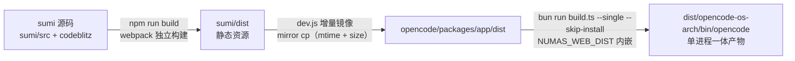
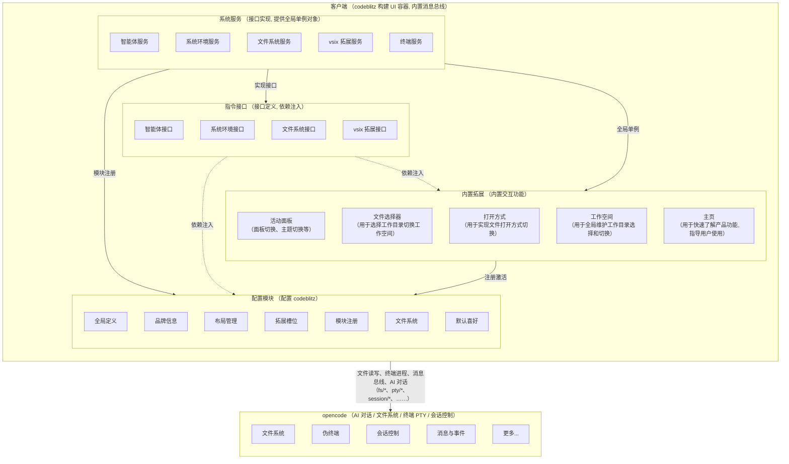

# Numas — AI 工作台

> **Numas (🐮 牛马 AI)** — 打工人首选 AI 工作模式。
> 一个本地一体化 AI IDE, 一行命令拉起, 对标腾讯 workbuddy。

---

## 1. 这是什么

Numas = **sumi (codeblitz/opensumi + React) 客户端** + **opencode (本地 fork) 后端** 二合一。

- 纯本地, 浏览器打开就用, 跨平台 mac / linux / win
- AI 助手 / 资源管理器 / 终端 PTY / PDF 阅读标注 / HTML 渲染 / 端口面板 / 内置浏览器 / Markdown 预览 全内置
- 单一端口 (默认 24096), 单一进程 (单进程一体)

### 设计原则

- **砍中间层**: 客户端直连 opencode (HTTP / WS / SSE), 无服务端代理
- **集成打包**: opencode 二进制内嵌 sumi dist, 启动即一体
- **DI 解耦**: 业务只依赖接口 Token (commands /), 替换实现 / 写测试都简单
- **消息总线统一**: chat / ask / ports / fs watcher 共用一条 SSE, 引用计数连接
- **vsix 拓展**: 独立打包, registry @ 7790 分发

### 三种部署形态

1. **集成模式 (默认开发)**: 单进程一体 — sumi 静态资源内嵌到 opencode 二进制, 启动即一体
2. **云原生模式**: 在集成模式之上加 Spring Cloud Gateway 控制面 + K8s, 按 userId 动态分配实例, 实例 id 作子域名反向代理
3. **前后端分离模式**: sumi 前端独立部署 (任意静态托管), 通过 `baseUrl` 直连模式 1 的 opencode 或模式 2 的 gateway

详见 [docs/AI 工作台总体设计.md](./docs/AI%20工作台总体设计.md)。

---

## 2. 快速开始

### 用户 (推荐)

```bash
npx -y github:weizuxiao911/numas
```

启动后浏览器自动打开 http://localhost:24096。

### 开发者

```bash
git clone https://github.com/weizuxiao911/numas
cd numas
npm install
npm run dev        # = node dev.js
```

### 前置

| 项 | 要求 | 说明 |
|---|---|---|
| Node | ≥ 20 (LTS 推荐) | dev.js 启动强校验, < 20 直接报错退出 |
| bun | 自动 | opencode build 依赖 (dev.js 启动时自检) |
| 端口 24096 | 空闲 | dev.js 启动前 `lsof -ti :24096` 清 zombie |

`npm install --ignore-scripts` 跳过 spdlog native postinstall (Python 3.14 删 distutils 后 node-gyp@9 必崩), opensumi 走 JS fallback logger, 主流程不受影响。

---

## 3. 命令行参数

```bash
npx -y github:weizuxiao911/numas [flags]
```

| Flag / Env | 默认 | 说明 |
|---|---|---|
| `--port <n>` / `NUMAS_PORT` | 24096 | opencode web 端口 |
| `--registry <url>` / `NUMAS_REGISTRY` | http://127.0.0.1:7790 | vsix registry 地址 |
| `--fast` / `NUMAS_FAST=1` | off | 跳过 sumi build / cp dist / opencode build, 只杀 port + 启 opencode (复用场景 5-10s → 1-2s). 改了前端代码必须去掉 |
| `--force-build` | off | 强制重 build (sumi + opencode), 忽略 hash 缓存 |

示例:

```bash
# 改端口
npx -y github:weizuxiao911/numas --port 8080

# 快启 (不重 build)
npx -y github:weizuxiao911/numas --fast

# 自定义 registry
npx -y github:weizuxiao911/numas --registry http://192.168.1.10:7790
```

---

## 4. 架构 (终态)

### 4.1 整体 (集成模式)

dev.js 编排: sumi deps 自检 → opencode binary 自检 → kill port → sumi build → mirror cp → opencode build (内嵌 sumi dist) → spawn `opencode web --port 24096`。



**进程树**: dev.js → opencode web (独立 detached 进程组, pgid=-pid). SIGINT 杀整组。

集成模式**只有一个**进程组 (opencode 自己 serve 内嵌的 sumi dist, 替换官方 UI)。

### 4.2 客户端分层 (sumi/src)

按 DI 思想分层, 业务只依赖接口 Token。



**通信分层铁律** (单向, 内层不依赖外层):

```
外部  →  service  →  commands  →  codeblitz  →  extensions
```

- `extensions/` 读写文件: 必须走 codeblitz (`@opensumi/ide-file-service` 的 `IFileServiceClient`) → opencode server fs API (`/api/fs/*`)
- **严禁** extensions 直接调用 service 层 `__APP_FS__` / `service/fs.ts` 的任何方法
- service 层是 commands / codeblitz / 其他 service 调用的基础设施, 不暴露给 extensions 直调
- commands 层定义对外 API / token / interface, 是 service 与 codeblitz 之间的契约

### 4.3 通信协议

| 用途 | 协议 | 入口 | 说明 |
|---|---|---|---|
| 文件读 | HTTP `GET /api/fs/read/<path>` | `sumi/src/service/fs.ts:840` | 走 codeblitz `IFileServiceClient` → opencode server fs API |
| 文件写 | HTTP `POST /api/fs/write` (base64) | `sumi/src/service/fs.ts:897` | 字节内容 base64 编码 |
| 文件删 / 建 / 移 | HTTP `/api/fs/remove` / `/mkdir` / `/rename` | `service/fs.ts` | 9 端点 |
| 文件树事件 | SSE `EventSource /global/event` (V1) | `service/fs.ts:711-760` | 服务端 `@parcel/watcher` (200ms 防抖) → `file.watcher.updated` |
| 终端 PTY | WS `${baseUrl}/pty/{id}/connect?directory=...` | `service/terminal.ts:325` | 远程 spawn shell, `/pty/shells` 探测 |
| AI 对话 | SDK `@opencode-ai/sdk/v2/client` | `service/agent.ts:184` | header 自动带 `x-opencode-directory` |
| vsix 拓展 | `GET /metadata.json` (kt-ext 协议) | `service/registry` | `extensions/` 三套独立 vsix 源码, esbuild 自打包 |

### 4.4 opencode fork 增量

`opencode/` 是 numas 仓库内嵌的完整 fork (31 个 packages), 不是 npm 包也不是 submodule。fork 增量:

- `scriptName("numas")` — 品牌替换
- CSP 全开放 (`server/shared/ui.ts:17-21`) — 给内嵌 opensumi 用
- `--registry` flag → HTML 注入 `window.__APP_CONFIG__.registryBaseUrl`
- `control-plane/` (多工作区路由) + `effect/` (Effect-TS runtime)
- `event-v2-bridge.ts` + `event-manifest.ts` (V2 事件总线桥接)
- `/api/fs/*` 9 个端点 (read / list / find / stat / write / mkdir / remove / rename / watch, base64 write)
- `x-opencode-directory` header + `?directory=` query (per-request workspace 路由)
- `@parcel/watcher` 服务端 fs watcher → `file.watcher.updated` SSE (200ms 防抖)
- `/api/ports` + `/proxy/<port>/` (PTY 跟踪 + 已知端口反代, 防 SSRF)
- `opencode web` 子命令 (instance: false, per-request workspace 路由, pre-warm + 1500ms 后自动开浏览器)

### 4.5 内置拓展

| 拓展 | 能力 |
|---|---|
| **actions** | SOLO 顶栏 (模式切换 / sidebar 展开镜像 / 项目选择 / 抽屉开关), 跨拓展走 `numas.sidebar.*` / `numas.drawer.*` 全局命令 |
| **sidebar** | SOLO 左侧栏 (模式切换 + 折叠按钮 + 新建会话 + 历史会话列表: 标题 + 相对工作目录 + 时间, 点击切换 / 删除, 排除 subagent 会话) |
| **chatbot** | SOLO 对话主区 (消息流 + 输入区 + 模型/智能体/附件), 跨拓展契约 `numas.chatbot.*` (newSession / listSessions / changeSession / deleteSession) |
| **ai 助手 (chat)** | 主聊天面板, 多 session / model / agent 切换, 工作目录切换, 附件上传, 走消息总线 |
| **ask (无头)** | 通用 AI 通道 `ask(prompt, cb)`, 独立 session, 流式回调, 可取消, 看门狗超时 |
| **filepicker** | 通用 filepicker modal, 监听 `filepicker:request` 事件 |
| **opentype** | 重写 explorer 右键 "打开方式 / 配置默认编辑器" |
| **pdf** | 内置 PDF 阅读器 (rect 圈选 → AI ask popover → 批注演示) + sidecar 持久化 |
| **welcome** | 空工作区欢迎页 (`onDidRestoreState` 自动开) |
| **workspace** | 引导页 + WorkspacePicker (监听 `workspace:request-show`) |
| **ports** | 端口面板 (PTY 启动服务跟踪 + 手动白名单 + 反代打开, 走消息总线) |
| **browser** | 内置浏览器 (URL 栏 + iframe 渲染 + PDF.js 渲染 + debugger API, localhost 强制反代同源) |
| **markdown** | markdown 预览 (双击 .md/.markdown 默认渲染, 可切 code 文本编辑器) |

注册入口: `sumi/src/config/modules.ts#getBuiltinModules` 统一注册 (14 个 Module)。

**SOLO 布局状态** (`service/layout` DI 单例): sidebar 折叠/宽度 + drawer 开合/宽度。渲染方 (SoloLayout) 读状态渲染; 操作方 (ActionBar / Sidebar) 经全局命令 `executeCommand` 调 `numas.sidebar.collapse/expand/toggle`、`numas.drawer.open/close/toggle`, 状态订阅走 `LayoutToken.subscribe`。交互规则:
- 默认 sidebar 展开, drawer 折叠
- drawer 展开 → 自动折叠 sidebar 让出空间 (关闭不自动恢复)
- sidebar 折叠 → action 栏镜像显示 模式切换 + 展开按钮
- sidebar 展开 → 镜像隐藏

**会话恢复 + 新建** (`chatbot`):
- 启动恢复: 查当前 cwd 的历史会话 → 有则载入最新的 (time.updated 最大), 无则新建草稿。无前端持久化缓存 (不依赖 sessionStorage)
- 新建会话按钮: 仅当**最新会话已有消息**时才创建; 最新仍是空草稿则不重复创建 (跳到它), 避免堆积空会话
- 历史会话列表: 显示全部会话 (含当前), 标题 + 相对工作目录 + 时间, 点击切换 / 删除

### 4.6 vsix 拓展 (registry 分发)

`extensions/` 三个独立 vsix 源码, **都不在 dev 模式加载**, 都走 registry 7790 分发:

| vsix | viewType | 能力 |
|---|---|---|
| `extensions/html/` | `htmlViewer` | HTML 预览/编辑 (iframe srcDoc), 双击 .html/.htm 命中 |
| `extensions/paper/` | `paperEditor` | 试卷/题库预览 (vite webview 渲染 .paper) |
| `extensions/pdf/` | `pdfViewer` | PDF 阅读 (vsix customEditor, PDF.js CDN) |

构建: 各自 `esbuild.config.mjs` → `dist/extension.js` → `scripts/package.js` 打 `.vsix`。registry `build.js` 扫描 `vsix/*.vsix` → adm-zip 解压 → `dist/<publisher>.<name>-<version>/` + 写 `metadata.json`。

**注意**: `extensions/pdf/` 跟 `sumi/src/extensions/pdf/` 是两套并行实现。内置版 (sumi/src) dev 模式直接加载, vsix 版走 registry 部署。

---

## 5. 工作原理 (终态)

### 5.1 文件系统

- **读**: HTTP `GET /api/fs/read/<path>` (opencode server side 直接走真实磁盘), ~10ms
- **写**: HTTP `POST /api/fs/write` (base64 content), ~100ms+
- **事件**: opencode 服务端 `@parcel/watcher` (mac: fs-events / linux: inotabit / win: windows native), 200ms 防抖 → 发出 `file.watcher.updated` SSE 事件 → 客户端解析后 `scheduleFsFire` (300ms 防抖) + hash 对比去重自己写
- **客户端零额外 watch 进程** — 不跑 watchexec / chokidar / fs.watch。全部在 opencode 服务端

### 5.2 BrowserFS 桥接

opensumi/codeblitz 通过 BrowserFS → `WriteSyncFS` (`sumi/src/config/runtime.ts:47`) → `getFileSystemService().write/rm/mkdirp/move` → `/api/fs/*`。

`WriteSyncFS._syncSync` 拦截墓碑日志:
- `/.browserfs_deletedFiles.log` (d 行 → 逐条 syncRm 宿主机)
- `/.browserfs_moves.log` (m 行 → 逐条 syncMove 宿主机)

日志只进 InMemory 不写宿主机 (避免 explorer 多出墓碑文件)。

**postinstall** (`sumi/scripts/patch-codeblitz-constant.js`) 就地改 `node_modules/codeblitz`:
- `constant.js`: `WORKSPACE_ROOT` 取 `APP_CWD` → sessionStorage → `__APP_CONFIG__.cwd` → `/workspace`
- `disk-file-system.provider.js`: `fse.move` (fs-extra copy+remove 实现, 损坏 30MB+ 大文件) → 桥接 `window.__APP_FS__.move`

### 5.3 工作目录切换全局影响

**来源优先级** (`sumi/src/service/env.ts`):
1. `localStorage.APP_CWD` (运行时切换) — 最高
2. `window.__APP_CONFIG__.cwd` (启动时固定) — 兜底

**全局影响**: opencode SDK header 自动带 `x-opencode-directory: encodeURI(cwd)` → 所有 SDK 调用 (file / AI / pty / event) 上下文跟随 → chat 文件引用 / 终端 cwd / 标注 sidecar 路径 全部跟随。

**CJK 路径**: HTTP header ISO-8859-1 限制, `x-opencode-directory` 必须 `encodeURI()` 包裹。

### 5.4 消息总线 (全局 SSE)

`sumi/src/service/event/eventBus.ts` 单例, **客户端唯一一条** SSE 连接 (`/global/event`), 引用计数:

- 多模块订阅: chat / ask / ports / fs watcher 共享同一条 SSE
- API: `onEvent(handler)` / `onEventType(types, handler)` / `onSessionEvent(sessionID, handler)`
- 自动重连 (无手写 3s 轮询), 总线统一负责
- 模块卸载时 `unsub()` → 引用计数归 0 → 关闭 SSE

---

## 6. 文档索引

| 文档 | 内容 |
|---|---|
| [AGENTS.md](./AGENTS.md) | AI 协作铁律 + 项目事实 + 约定/禁忌 |
| [docs/AI 工作台总体设计.md](./docs/AI%20工作台总体设计.md) | 总体架构 + 客户端分层 + 三种部署形态 + 关键技术决策 |
| [docs/AI 工作台功能清单.md](./docs/AI%20工作台功能清单.md) | 已落地功能勾选清单 |
| [docs/文件系统服务设计与测试用例.md](./docs/文件系统服务设计与测试用例.md) | fs 设计 (DynamicRequest read + WriteSyncFS write + OverlayFS) + 验收 |
| [docs/标注功能设计与测试用例.md](./docs/标注功能设计与测试用例.md) | PDF 标注设计 + AI ask popover + 批注演示 |
| [docs/Markdown预览功能设计与测试用例.md](./docs/Markdown预览功能设计与测试用例.md) | markdown 预览拓展设计 + 验收 |
| [docs/内置浏览器扩展设计与测试用例.md](./docs/内置浏览器扩展设计与测试用例.md) | 内置浏览器扩展设计 + 验收 |
| [docs/消息总线服务设计与测试用例.md](./docs/消息总线服务设计与测试用例.md) | 客户端消息总线统一 /global/event SSE 设计 + 验收 |
| [docs/AI 助手及消息总线对接功能设计与测试用例.md](./docs/AI%20助手及消息总线对接功能设计与测试用例.md) | AI 助手 chat 面板消息总线接入设计 + 验收 |
| [docs/无头ask命令功能设计与测试用例.md](./docs/无头ask命令功能设计与测试用例.md) | ask 无头通道 workspace 修复 + 硬化设计 + 验收 |
| [docs/端口代理转发和总线消息对接功能设计与测试用例.md](./docs/端口代理转发和总线消息对接功能设计与测试用例.md) | PTY 启动服务跟踪 + 端口反代 + 消息总线接入设计 + 验收 |

---

## 7. 已知限制

- **PDF 标注**: 跨页选区不支持, 不支持编辑已有标注, 无侧栏列表
- **PDF 缩放**: 5 档 (50 / 75 / 100 / 125 / 150)
- **多用户**: 不支持 (opencode 单实例, 无服务端, 模式 2 gateway 才有多租户)
- **历史持久化**: opencode SQLite (`~/.local/share/opencode/opencode.db`)
- **registry 7790**: 手动启, dev 模式不自动启

---

## 8. 排错 FAQ

**Q: 启动后浏览器没自动打开?**
A: 系统 `open` / `xdg-open` 不可用 (headless server)。手动打开 http://localhost:24096。

**Q: 端口 24096 被占?**
A: `lsof -ti :24096 | xargs kill -9` 清 zombie, 或 `--port <n>` 改。

**Q: `npm install` 卡 spdlog 报错?**
A: Python 3.14 删 distutils 后 node-gyp@9 必崩。dev.js 已加 `--ignore-scripts` 跳过, opensumi 自动 fallback JS logger。

**Q: 改了前端代码但 UI 没变?**
A: 跑 `node dev.js --force-build` 强制 rebuild, 或去掉 `--fast`。

**Q: 重启很慢?**
A: 用 `--fast` 跳过 build/cp (前提: 上次 build 后没改 sumi/src/ 或 opencode 源码)。

**Q: Node 版本 < 20?**
A: dev.js 启动即报错退出, 提示安装链接 https://nodejs.org。

**Q: npx 首次执行不提示确认?**
A: 加 `-y` 跳过 (`npx -y github:weizuxiao911/numas`)。缓存失败 `rm -rf ~/.npm/_npx`。

**Q: 文件系统 watcher 不响应?**
A: 检查 opencode 服务端 `@parcel/watcher` 是否启动 (mac: fs-events / linux: inotify / win: windows)。客户端只订阅 SSE, 自身不跑任何 watch 进程。

**Q: 中文路径 404?**
A: opencode SDK header 自动 `encodeURI` cwdHeader。散落 fetch 必须用全局 SDK (`window.__APP_OPENCODE__`)。

---

## 9. 关闭

`Ctrl+C` → dev.js 杀整组 (opencode + 二进制进程)。

---

## License

MIT