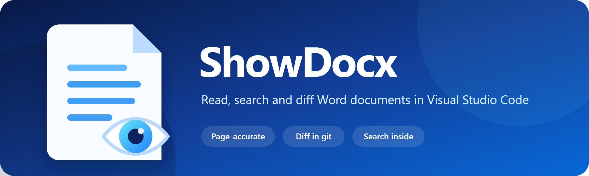
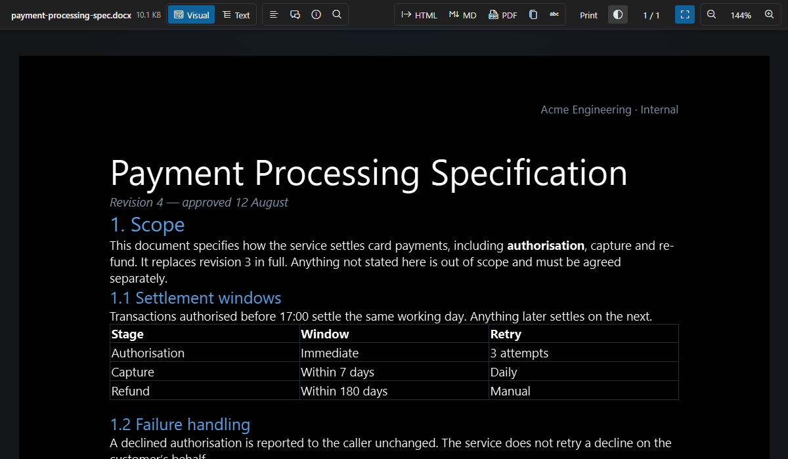

<p align="center">
  
</p>

<p align="center">
  Open and read Word documents — <code>.docx</code>, <code>.docm</code>, <code>.dotx</code>, <code>.dotm</code> — directly in Visual Studio Code with page-accurate and semantic views.
</p>

<p align="center">
  <a href="https://github.com/showdocx/show-docx/actions/workflows/ci.yml"></a>
  <a href="https://marketplace.visualstudio.com/items?itemName=showdocx.docx"></a>
  <a href="https://marketplace.visualstudio.com/items?itemName=showdocx.docx"></a>
  <a href="https://github.com/showdocx/show-docx/releases"></a>
  <a href="LICENSE"></a>
</p>

## What it does

VS Code cannot open a Word document, and git cannot diff one. Docx answers both, without the document leaving your machine.

<p align="center">
  
</p>

### The three things nothing else does

- **Diff a document against git.** Right-click a `.docx` and choose **Compare with HEAD**. Git reports Word files as `Binary files differ` and the diff editor cannot open one, so both revisions are converted to readable text and shown in VS Code's own diff editor. The text is shaped so that a one-word edit is one changed line, rather than a full rewrite every time Word re-saves the file.
- **Search inside every document at once.** VS Code's own search skips these files because they are binary. **Search in Word Documents** looks inside all of them, shows the line each match is on, and opens the document with the term already in its find bar.
- **Let an agent read a document.** Docx registers a language model tool, so Copilot agent mode — or anything using the same API — reads `spec.docx` instead of giving up on a ZIP archive. `@docx` answers questions about the document you have open. Docx calls no model and makes no network request: the model is the one your own chat is already using.

### Reading

- **Visual mode** renders the Word page layout — headers, footers, tables, images, footnotes and page sizing — with `docx-preview`. Pages break where the document declares them; nothing is repaginated.
- **Text mode** converts the document to clean, theme-aware semantic HTML with `mammoth`.
- **Page themes** — paper, sepia or dark. Most VS Code users run a dark theme, and an 80-page white page does not have to be the only option.
- **Fit to width, fit to page**, held against the panel as you resize it, plus zoom from 25% to 400% by toolbar, keyboard or `Ctrl/Cmd` + wheel.
- **A page indicator** showing which page is on screen, and a prompt to jump to another.
- **Where you left off** — mode, zoom, page theme and reading position, remembered per document across sessions.

<p align="center">
  
</p>

### Finding things

- **In-document search** (`Ctrl/Cmd + F`) with live highlighting and match navigation, matching phrases that span bold, italic or any other formatting change.
- **An outline** built from the heading styles the document declares — so it is right for documents whose styles are not named in English, and does not invent entries from styles that merely sound like headings.
- **Comments and tracked changes** with their authors and dates, read from the document's own parts, so the list is the same in Visual and Text mode — including the text a deletion removed.
- **Document properties** — title, author, who last modified it, dates and revision. Questions a contract raises constantly, and which take several clicks to answer in Word itself.
- **Counts in the status bar**: pages, words and an estimated reading time.
- **A right-click menu on a selection**: copy it, find it here, or find it across every document.

### Getting things out

- **Copy to the clipboard** as Markdown or plain text, in one click. Most of the time the content is wanted in an issue or a message, not in a file.
- **Export** sanitized HTML, Markdown, or printable HTML that opens your browser's **Save as PDF**. The printable file carries the page layout — breaks, headers, footers, tables and embedded images — rather than a reflowed text view.
- **Extract images** to a folder, so a diagram can go straight into a README.
- **Markdown mirrors**, optional and never created without being asked, so `git diff` and pull requests can read what changed in a document.

### How it behaves

- **Four Word formats**: `.docx`, `.docm`, `.dotx` and `.dotm`. All four are the same OOXML package; a macro is never executed.
- **Automatic reload** when the file changes on disk, without disturbing where you are reading.
- **Hidden tabs are released** rather than holding their rendered pages in memory for something nobody is looking at.
- **Large documents** are transferred to the viewer in 1 MB chunks.
- **Theme support** across light, dark, high-contrast and forced-color modes.
- **A sandboxed webview** with a strict Content Security Policy, nonce-protected scripts, restricted external links and sanitized output.

## Usage

1. Open any `.docx`, `.docm`, `.dotx` or `.dotm` file. Docx is registered as the default custom editor for all four; they are the same OOXML package, and a macro is never executed.
2. Use **Visual** for the Word-like page layout or **Text** for a clean reading view.
3. Press `Ctrl/Cmd + F` to search within the document.
4. Open the **Outline** or **Comments** sidebars from the toolbar to navigate structure and reviews.
5. Use the toolbar or `Ctrl/Cmd` + `+`, `-`, and `0` to control zoom.
6. Export the document as **HTML** or **MD** (Markdown) from the toolbar or Command Palette. **PDF** saves printable HTML of the page layout and opens it in your browser, where **Print → Save as PDF** produces the file. It prints the pages you see in Visual mode, whichever mode you started the export from.

To choose Docx explicitly, right-click a `.docx` file and select **Open with Docx**.

### Searching across documents

Run **Docx: Search in Word Documents** from the Command Palette and type. Matches from every Word document in the workspace appear as you type, with the line they were found on; choosing one opens the document with the term already in its search bar.

Text is read straight out of each document's XML and cached against the file's modification time, so the first search reads the files and later ones are immediate. Headers and footers are searched too — that is where a document number or title usually lives. Field codes and text removed by a tracked change are not, because neither is text the reader sees.

The API that would put these results in VS Code's own search panel is still proposed, so this is a separate command for now.

### Markdown mirrors

Comparing revisions inside the editor is one problem; `git diff` in a terminal and a pull request on GitHub are another, and both see a Word document as `Binary files differ`. **Docx: Write Markdown Mirrors** writes a `.md` copy of each document, meant to be committed alongside it, so those tools can read what changed.

Docx **never creates a mirror on its own.** Creating them is the command above, which says how many and where before writing anything. Setting `docx.markdownMirror` to `onChange` keeps mirrors that already exist up to date when their documents change; it will not add new files. `docx.markdownMirrorDirectory` puts them somewhere other than beside the document.

Each mirror opens with a comment naming the document it came from, so nobody meeting one in a review has to guess.

### Comparing revisions

Right-click a `.docx` in the Explorer and choose **Compare with HEAD**, or run it from the editor title bar or the Command Palette. Both revisions open in the normal diff editor as text.

The text is shaped for diffing rather than for reading: one line per paragraph and per table row, ordered list items all written `1.`, and embedded images reduced to a short digest of their bytes. Word rewrites the whole package on every save, so without that normalization each revision would read as a full rewrite. A one-word edit shows up as one changed line.

Requires `git` on the `PATH`, or the `git.path` setting. Deletions in tracked changes are not shown, for the same reason Text mode does not show them.

### Letting an agent read a document

An AI agent running in your editor cannot read a `.docx`: opening one returns a ZIP archive. Docx registers a `showdocx_readDocx` language model tool that returns the document as Markdown, so the agent can read `spec.docx` the way it reads any other file. Reference it in a prompt as `#docx`.

**Docx calls no model.** Your own agent, on your own subscription, asks this extension for text it already knows how to produce. There is no API key, no cost and no outbound request — the privacy guarantee below holds exactly as written.

Only documents inside the open workspace can be read, and only `.docx` files. A model's arguments can be steered by whatever it has read, so the tool treats a path as a request rather than a permission.

The tool needs VS Code 1.95 or later. Docx still declares support from 1.85, detects the API at runtime, and simply does not register the tool where it is absent.

### Asking about a document in chat

Type `@docx` in the chat panel and ask about the document you have open: "summarize this", "what does clause 4 say", "turn this spec into a task list". With nothing after the mention, it summarizes.

The model is the one your chat is already using — Docx never picks a vendor and never calls a model itself. The document is converted to Markdown and sent as part of your own request, and the participant is told to answer only from it and to say when the document does not contain the answer. A long document is cut at a line boundary and the answer says so, rather than the request failing.

Like the tool above, the chat API is newer than the supported floor, so the participant is simply absent on an older editor.

## Commands

| Command | Purpose |
| --- | --- |
| `Docx: Compare with HEAD` | Compare the document with its committed revision in the diff editor |
| `Docx: Find in Document` | Open in-document search bar (`Ctrl/Cmd + F`) |
| `Docx: Search in Word Documents` | Search inside every Word document in the workspace |
| `Docx: Show Document Properties` | Open the properties sidebar |
| `Docx: Extract Images` | Write every image in the document to a folder |
| `Docx: Write Markdown Mirrors` | Write a committable `.md` copy of every Word document in the workspace |
| `Docx: Export as HTML` | Export sanitized semantic HTML |
| `Docx: Export as Markdown` | Export clean Markdown document (`.md`) |
| `Docx: Copy as Markdown` | Put the document on the clipboard as Markdown |
| `Docx: Copy as Plain Text` | Put the document on the clipboard with no markup |
| `Docx: Print to PDF (via Browser)` | Save printable HTML and open your browser's print dialog (`Ctrl/Cmd + Alt + P`) |
| `Docx: Zoom In` | Increase zoom by 10% |
| `Docx: Zoom Out` | Decrease zoom by 10% |
| `Docx: Reset Zoom` | Reset zoom to 100% |
| `Docx: Fit Page to Width` | Scale the page to the panel width, and hold it as the panel is resized |
| `Docx: Fit Whole Page` | Scale so a whole page is visible |
| `Docx: Toggle Visual/Text Mode` | Switch rendering engines |
| `Docx: Change Page Theme` | Cycle the Visual-mode page between paper, sepia, and dark |
| `Docx: Show Log` | Open the Docx log channel for diagnosing a failure |

## Settings

| Setting | Default | Description |
| --- | --- | --- |
| `docx.defaultMode` | `visual` | Initial `visual` or `text` rendering mode |
| `docx.defaultZoom` | `100` | Initial zoom level from 25 to 400 |
| `docx.maxFileSizeMb` | `100` | Maximum file size accepted by the viewer |
| `docx.autoReload` | `true` | Reload when the DOCX changes on disk |

## Installation

Install [Docx from the Visual Studio Marketplace](https://marketplace.visualstudio.com/items?itemName=showdocx.docx), search for `Docx` in the VS Code Extensions view, or run:

```bash
code --install-extension showdocx.docx
```

For manual or offline installation, download `docx-1.1.1.vsix` from the
[latest GitHub release](https://github.com/showdocx/show-docx/releases/latest), then run:

```bash
code --install-extension docx-1.1.1.vsix
```

You can also use **Extensions: Install from VSIX...** from the VS Code Command Palette.

## Development

```bash
npm ci
npx playwright install chromium
npm run generate:fixtures
npm run verify
npm run package
```

Press `F5` in VS Code to start the Extension Development Host and open `test/workspace/simple.docx`.

## Verification

```bash
npm run verify
```

`verify` runs linting, TypeScript checks, unit tests, VS Code Extension Host tests, and Chromium webview tests. Integration tests download a VS Code test runtime on first use. Linux environments require Xvfb.

## Architecture

Docx is a `CustomReadonlyEditorProvider`. The extension host reads and watches the DOCX binary, validates size and ZIP signatures, then transfers the document to a sandboxed webview. The browser bundle selects `docx-preview` or `mammoth`, keeps rendered modes cached, and persists UI state through the VS Code webview state API.

The extension and webview are independently bundled by esbuild for Node 18 and Chromium 114, matching the minimum VS Code 1.85 runtime declared in `engines`.

The pinned `docx-preview` compatibility changes are stored as a versioned `patch-package` patch, so local and CI builds use the same renderer code.

## Privacy

Documents are processed entirely on your machine inside the VS Code extension host and sandboxed webview. Docx does not upload document contents, include telemetry, or contact an external service. External links are opened only after an explicit click, and not at all while the workspace is untrusted.

## Known Limitations

- `.doc` binary files are not supported. No reliable pure-JavaScript reader exists for the legacy format, and half-working output is worse than none.
- Markdown output — exported, copied, or read by an agent — replaces an embedded image with a short placeholder rather than inlining megabytes of base64.
- Text mode shows tracked changes as accepted: `mammoth` drops deletions and inlines insertions. The viewer says so in its rendering notes; the comments sidebar lists what was removed, and Visual mode shows the markup in place.
- A comment can be followed to its place in the document in Visual mode only. Text mode renders no anchors, so its cards are a list rather than links.
- Search matches at most 2000 results per query, shown as `2000+`. Workspace search shows at most 300 matches, and at most 20 per document.
- Table of contents, bookmarks, advanced Word fields, and some hyperlinks are limited by the open-source rendering engines.
- Visual mode prioritizes page fidelity, but highly complex Word layouts may differ from Microsoft Word.
- Pages break where the document declares them; Docx does not repaginate, so the page count can differ from what Word reports for the same file.
- HTML export is semantic and intentionally does not reproduce the exact page layout; the PDF export does.
- If Visual mode cannot render a document at all, the PDF export falls back to the semantic text view rather than failing.
- Comparing revisions covers `HEAD` and local files. Comparing two selected documents, arbitrary revisions, and following a rename are not implemented yet.
- Password-protected or encrypted documents are not supported.

## Publishing

Tags matching the package version, such as `v1.2.0`, run the full verification suite, package a VSIX, generate a SHA-256 checksum, and create a draft GitHub release.

Stable releases are also published under the `showdocx` publisher on the
[Visual Studio Marketplace](https://marketplace.visualstudio.com/items?itemName=showdocx.docx). Marketplace publishing is currently a separate manual release step.

## Contributing

See [CONTRIBUTING.md](CONTRIBUTING.md).

Security issues should be reported according to [SECURITY.md](SECURITY.md).

## Third-party licences

Docx bundles `docx-preview`, `mammoth`, `JSZip`, `DOMPurify` and the VS Code
codicons, along with their dependencies. All are under permissive licences, and
each notice is reproduced in [THIRD-PARTY-NOTICES.md](THIRD-PARTY-NOTICES.md),
generated from what the bundles actually contain.

The codicons are by Microsoft under CC-BY-4.0.

## License

[MIT](LICENSE)
