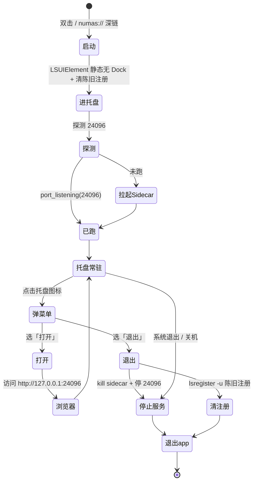

# numas desktop shell (Tauri)

最小化后台运行的 numas 桌面壳：托盘常驻，托管随包的 numas server（`http://127.0.0.1:24096`），
浏览器作为 UI，支持 `numas://serve?port=24096` scheme 唤起。

---

## 1. 功能设计（终态行为）

### 1.1 运行模型（状态机）



**关键决策**:
- **点击托盘图标只显示菜单 [打开] [退出]**; [打开] → 浏览器访问 `http://127.0.0.1:24096`; [退出] → 退出 app + 停掉 24096 进程
- **双击/深链只托盘后台**, 不抢前台弹窗
- **无 Dock**: `Info.plist` 静态 `LSUIElement=true`, app 启动起即无 Dock、仅托盘（不依赖运行时 Accessory 切换）
- **只停自己拉起的 server**: `ServerState` 记录自己 spawn 的 `CommandChild`; 退出时仅 kill 它
- **托盘单色模板**: `icon_as_template(true)` + 22px 纯黑 alpha `tray.png`, 系统按主题自动渲染

### 1.2 启动时自动清理 LaunchServices 陈旧注册（macOS）

**背景 / 根因** (2026-09-20 排查):
拖拽 / 脚本 / 手动安装 numas.app 后, 旧的废弃拷贝（`.Trash/`、旧路径）仍留在 LaunchServices
注册表。macOS 按 **bundle id** 记忆 Accessory/Dock 状态:
- 若旧托盘项曾在 Accessory 状态被创建并放入隐藏位, 该 bundle id 会**持续隐藏**
- 重装新 app 后, 系统仍按旧路径 / 旧 bundle 记忆拉起 → **托盘非单色 / Dock 闪现 / 状态继承**等诡异行为

**清理规则** (`lib.rs:236 cleanup_stale_registrations`):
- **继承当前**: 正在运行的 app 自身注册保留
- **移除旧的**: 除当前运行 app 外的所有 numas.app 注册全部 `lsregister -u`
  （同一 bundle id 同一时刻只应有一个活跃 app; 其它路径的注册都是旧的/冲突的）
- 纯后台线程执行, 不阻塞启动; 失败静默忽略
- **覆盖所有安装方式**: 拖拽 / 脚本 / 手动 cp 安装后首次启动都会自动清一次

### 1.3 无 Dock 实现：静态 LSUIElement + 固定 bundle id（铁律）

> **bundle id = `com.numas.app`（固定）**; **无 Dock 靠 `Info.plist` 静态 `LSUIElement=true`**。
> **禁止**用运行时 `set_activation_policy(Accessory)` 切换无 Dock —— 那正是 macOS 记忆"托盘隐藏状态"的触发点。

**为什么** (2026-09-20 实锤, 两次踩坑后定位):
macOS 26 按 **bundle id** 记住菜单栏项的隐藏状态。若 app 曾在运行中通过 `set_activation_policy(Accessory)`
切换无 Dock, 该 bundle id 会被系统**持续记忆**托盘隐藏位, 之后重装同 id 的 app, 托盘不再显示
（单色 icon 消失 / Dock 闪现）。历史上:
1. 18号: `dev.numas.desktop` → 运行时 Accessory → 换 id `dev.numas.app` 暂时修复
2. 20号: `dev.numas.app` 复发 → 一度误用「每版换 id `dev.numas.<semver>`」
3. **最终治本**: 弃用运行时切换, 改 **`Info.plist` 静态 `LSUIElement=true`**（与系统托盘 app 同法,
   app 从启动起就是无 Dock）, + 固定 bundle id `com.numas.app`。**静态声明不触发系统记忆 → 固定 id 托盘也正常**

**对比**: 微信等正常 app 用固定 id (`com.tencent.xinWeChat`) 且不切 Accessory, 托盘一直正常。
我们的坑根源是"运行时切 Accessory", 不是 id 本身。

**实现**:
- `tauri.conf.json` → `"identifier": "com.numas.app"`（固定）
- `Info.plist` → `<key>LSUIElement</key><true/>`（Tauri `bundle.macOS.infoPlist` merge 进产物）
- `lib.rs` → **没有** `set_activation_policy` 调用
- `scripts/build.ts` → 只注入 `version`, **不覆盖** identifier
- 验证: 产物 `Info.plist` 应有 `LSUIElement=true` 且 `CFBundleIdentifier=com.numas.app`

---

## 2. 目录结构

```
packages/tauri/
├── src/
│   ├── main.rs          # 入口, 调 numas_tauri_lib::run()
│   └── lib.rs           # 全部逻辑: 托盘 / server 生命周期 / 深链 / LaunchServices 清理
├── scripts/
│   ├── prepare.ts       # 构建前同步 numas CLI → binaries/numas-<triple>
│   ├── build.ts         # 打包 (读 version.json, 透传 --target)
│   ├── release.ts       # GitHub Release 发布 (读 CHANGELOG.md)
│   └── install-macos.sh # macOS 一键安装 (去 quarantine + 启动)
├── icons/
│   └── tray.png         # 22px 单色模板托盘图标
├── binaries/            # (gitignored) sidecar, 构建时由 prepare.ts 生成
├── tauri.conf.json      # 壳配置 (externalBin / deep-link scheme)
├── Info.plist           # macOS 文件夹访问描述
└── CHANGELOG.md         # 发版说明 (release.ts 读取作 Release notes)
```

---

## 3. 生命周期设计（谁拉起、谁停止）

```mermaid
flowchart TD
    A[双击 app] --> S{24096 在跑?}
    B[numas://serve?port=24096] --> S
    C[托盘「打开」] --> S
    D[点击托盘图标] --> E[弹出菜单 [打开] [退出]]
    S -- 否 --> F[拉起 sidecar]
    S -- 是 --> G[复用, 不重复拉起]
    F --> H[server 就绪]
    G --> H
    H --> I[托盘常驻]
    C -. 等健康就绪后 .-> J[浏览器访问 24096]
    E --> C
    E --> K[托盘「退出」]
    K --> L[kill sidecar + 停 24096]
    K --> M[清 LaunchServices 陈旧注册]
    L --> N[退出 app]
    M --> N
    I -. 系统退出/关机 .-> L
```

**生命周期关键点**:
- `port_listening(port)` 探测 → 已有服务则**复用**, 不重复拉起
- 自己拉起 → 存进 `ServerState`, 退出时 kill
- **[退出] 语义** (2026-09-20 用户拍板): 无条件停 24096 进程 (不管是否自己拉起) + 清 LaunchServices 陈旧注册 + 退出 app

---

## 4. 本地构建

先构建当前平台的 numas CLI（内嵌 codeblitz）：

```bash
cd packages/opencode
bun run build --single
```

再构建壳（自动把二进制同步到 `binaries/numas-<target-triple>`）：

```bash
cd packages/tauri
bun run build                 # 当前平台
bun run build:arm64           # macOS arm64
bun run build:x64             # macOS x64（需先 rustup target add x86_64-apple-darwin）
bun run build:universal       # macOS universal（需两个架构的 numas 二进制）
```

跨架构时先用 `NUMAS_TARGET` 交叉构建对应二进制，例如：

```bash
cd packages/opencode
NUMAS_WEB_DIST=../codeblitz/dist NUMAS_TARGET=darwin-x64 bun run script/build.ts
```

产物在 `packages/tauri/target/release/bundle/`（macOS: dmg/app，Windows: nsis，Linux: appimage/deb/rpm）。

开发调试：

```bash
cd packages/tauri
bun run dev
```

---

## 5. 安装（macOS）

### 方式 A: 一键脚本

```bash
bash install-macos.sh numas_0.1.18_aarch64.dmg
```

脚本流程: 杀旧进程 → 挂载 dmg → 替换安装到 `/Applications` → 去 quarantine → 启动。

### 方式 B: 拖拽安装（标准 Finder）

打开 dmg → 把 `numas.app` 拖进 `Applications` 软链。
**无需手动清注册表** —— app 首次启动会自动清理 LaunchServices 陈旧注册（见 §1.2）。
首次打开若被 Gatekeeper 拦: `xattr -cr /Applications/numas.app`，或 系统设置 → 隐私与安全性 → 「仍要打开」。

---

## 6. macOS 签名 + 公证

无凭据时构建会自动 ad-hoc 整包签名（仅本机可用；分发到别的机器会被 Gatekeeper 拦）。对外分发需要 Developer ID：

1. 安装 `Developer ID Application` 证书到登录钥匙串
2. `cp .env.example .env.local`，填入证书名与公证凭据（Bun 自动加载 `.env.local`）
3. `bun run build` → 自动签名 + 公证 + staple

凭据只放 `.env.local`（已 gitignore），不入库。

---

## 7. 发布流程

```bash
# 1. 构建 (可选 --target 指定架构)
cd packages/tauri && bun run build

# 2. 发布 (读 version.json + CHANGELOG.md)
bun run scripts/release.ts            # 真实发布
bun run scripts/release.ts --dry-run  # 只预览
```

规则（单一事实源）:
- 版本号: 读 `../../version.json`（`major.minor.patch`）
- tag: `numas-v<semver>-<YYYYMMDDHHMM>`
- asset 命名: `numas-darwin-arm64.dmg` / `numas-darwin-x64.dmg` 等（连字符, 平台用 darwin/windows/linux）
- Release title 只写版本号; notes 从 `CHANGELOG.md` 对应 `## [<semver>]` 段读
- 上传 `weizuxiao911/numas`; 幂等（同 tag 复用, `--clobber` 覆盖）
- **opencode 二进制版本固定官方 `1.18.30`**（`packages/script/src/index.ts` 的 `NUMAS_VERSION`）,
  `version.json` 只作用于 codeblitz / tauri 壳版本, 不影响 opencode 二进制 UA

---

## 8. 说明

- 全平台打包靠本机构建（macOS/Windows/Linux × x64/arm64），不使用 CI
- `icons/` 为 🐮 占位图标（`bunx @tauri-apps/cli icon <1024.png>` 生成），可随时替换
- 壳不依赖系统已安装的 numas，二进制随包分发
