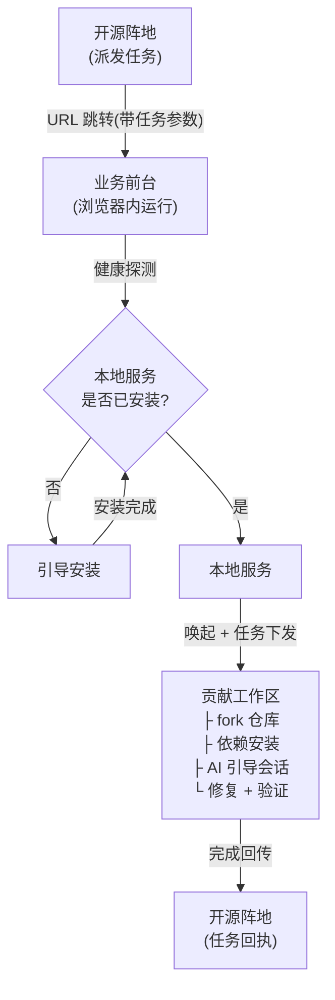

# 开源项目贡献 AI 工作台功能需求规格书

> 文档级别： PRD (Product Requirements Document)
> 修订版本号： v0.1.20
> 更新内容： 36 条验收标准在编号后增加一句话验收项概要,方便快速浏览
> 最后更新时间: 2026-09-17 15:56:08
> 作者： weizuxiao

---

## 1. 总体概述

### 1.1 背景介绍

随着开源生态的持续扩张,越来越多的开源项目方希望让自身用户能够"在被认证与受控的场景下"参与外部开源项目的贡献, 如开源项目方发布指定的 issue 修复任务, 开发者参与并提交 PR 以换取任务奖励等。但贡献一个陌生开源项目对大多数开发者而言仍存在显著门槛,典型痛点包括：

- **环境门槛高**：不同项目使用不同语言、构建工具、依赖管理方式,新贡献者常被"装环境"劝退。
- **上下文理解难**：贡献者需要阅读 issue 描述、相关代码、PR 模板与项目规范,认知负担大。
- **流程不规范**：fork / branch / commit / push / PR 流程一旦出错,沟通成本与时间成本陡增。
- **AI 工具割裂**：现成的 AI 编程助手往往独立于开源阵地,任务来源、上下文与最终交付物无法贯通。

`开源项目贡献 AI 工作台`(以下简称"AI 工作台")是`开源阵地`平台内嵌的一个核心模块,承接"开发者领取任务"之后的全部交互流程。AI 工作台基于运行在本地的服务提供 Web IDE 体验,具备"本地完整开发环境 + 远程 Web 接入"的能力。其目标,是为开发者提供**任务领取 → 环境就绪 → AI 引导修复 → 验收交付**的端到端体验,并把交付结果回传至开源阵地。

### 1.2 目标定位

#### 1.2.1 产品定位

`开源项目贡献 AI 工作台` 是`开源阵地`的内嵌模块,服务开发者,是开源项目方发布的任务在领取后到交付前的承接与执行环境。

#### 1.2.2 核心目标

| 目标维度 | 描述 |
| --- | --- |
| **降低门槛** | 让首次贡献者也能在 30 分钟内完成首次 commit |
| **保障任务贯通** | 从开源阵地 URL 传参到最终 PR 链接回传,任务上下文不丢失 |
| **AI 增强但不替代** | AI 提供诊断、建议、补丁候选与解释,关键修复由开发者确认 |
| **环境即开即用** | 首次接入自动检测/引导安装,后续接入秒级唤起 |
| **可控可审计** | 所有 AI 操作与代码变更可回溯,符合开源项目方合规要求 |

#### 1.2.3 非目标 (Out of Scope)

- 本工具**不定义**"什么算一个可领取的开源贡献任务",任务规则由开源阵地决定,本工具只负责接收与执行。
- 本工具**不维护**任务池、不做 issue 撮合、不替代开源项目方的任务中心。
- 本工具**不强制**贡献到特定平台(GitHub / GitLab / Gitee 等),目标平台由任务参数决定。
- 本工具**不替代**通用的项目管理、终端、调试等开发能力,这些能力在本产品内继续可用。

#### 1.2.4 关键名词

| 名词 | 定义 |
| --- | --- |
| **开源阵地** | 平台本身,服务于开源项目方与开发者两端。开源项目方在此发布任务、配置规则、奖励与审核;开发者在此领取任务,任务领取后由 AI 工作台承接 |
| **AI 工作台** | 开源阵地的内嵌模块,服务开发者,承接任务领取后到交付前的全部交互流程,本文档描述对象 |
| **本地服务** | AI 工作台的后台部分,核心提供运行时沙箱环境,包含文件系统、终端、git 仓库管理以及 AI 工具等服务 |
| **业务前台** | AI 工作台提供给开发者的浏览器内交互界面,是开源阵地派发任务后向开发者延展的载体。核心承载 IDE 体验(代码编辑、文件浏览、命令面板、终端面板等),同时提供开源项目 / issue 流程接入、项目 fork / commit / PR 等 git 操作、以及本地服务的桥接接入 |
| **任务上下文 (Task Context)** | 由开源阵地 URL 传入,描述"要做什么"的标准化载荷 |
| **贡献工作区 (Contribution Workspace)** | AI 工作台内为单个任务分配的隔离工作区,包含 fork 仓库、依赖、AI 记忆等 |

---

## 2. 流程说明

### 2.1 交互链路

整体交互为**开源阵地(任务领取)→ AI 工作台(任务交互)→ 本地服务 → 贡献工作区**的四段链路。详细流程如下：

#### 关键步骤说明

| 阶段 | 触发 | 关键产物 | 失败处理 |
| --- | --- | --- | --- |
| 1. 开源阵地跳转 | 用户在开源阵地点击"开始任务" | 携带任务参数的 URL | — |
| 2. 健康探测 | Web 加载时探测本地服务端口 | 探测结果 (已安装 / 未安装 / 异常) | 未安装 → 引导安装;异常 → 给出可读错误与日志跳转入口 |
| 3. 唤起后台 | 已安装则唤醒 AI 工作台主进程 | 已认证的 WebSocket / 内网通道 | 唤起失败 → 重试 + 降级到"仅查看任务说明"模式 |
| 4. 创建工作区 | 后台接收任务参数 | 唯一 contribution_id | 参数缺失或非法 → 拒绝并提示回到开源阵地 |
| 5. 引导会话 | 工作区就绪后启动 | AI 任务简报 + 修复计划 | AI 不可用 → 退化为静态任务说明 |
| 6. 修复交互 | 开发者在 IDE 中编码 | diff / commit / 验证日志 | 任意步骤可中断恢复 |
| 7. 验收交付 | 开发者点击"提交" | PR 链接 + 自检报告回传开源阵地 | PR 失败 → 给出原因并保留本地进度 |

### 2.2 功能清单

按用户视角划分为六大功能模块：

#### F1. 环境就绪模块
- F1.1 本地服务健康探测(端口/版本/进程)
- F1.2 未安装场景的引导下载与安装指引
- F1.3 已安装场景的唤起与重连
- F1.4 跨平台适配(macOS / Windows / Linux)

#### F2. 任务接入模块
- F2.1 从开源阵地 URL 解析任务参数
- F2.2 任务参数合法性校验(必填字段、签名/防伪)
- F2.3 创建隔离的贡献工作区
- F2.4 任务上下文持久化(允许断网/刷新后恢复)

#### F3. 仓库准备模块
- F3.1 目标仓库识别(GitHub / GitLab / Gitee)
- F3.2 自动 fork 与本地克隆(使用任务授权的凭据)
- F3.3 基线分支与贡献分支创建
- F3.4 依赖探测与一键安装(运行时自动识别语言/包管理器)

#### F4. AI 引导模块
- F4.1 任务简报生成(基于 issue 描述与代码上下文)
- F4.2 多轮引导会话(诊断 → 思路 → 计划 → 风险)
- F4.3 代码解释与定位辅助(语义搜索、调用链、相关测试)
- F4.4 补丁候选生成与差异对比
- F4.5 引导中断与续聊

#### F5. 修复执行模块
- F5.1 集成 IDE 内现有编辑器、终端、调试器
- F5.2 自动运行项目测试与 lint(可配置)
- F5.3 提交信息规范化(参考任务模板)
- F5.4 远程推送与 PR 创建(使用任务授权凭据)

#### F6. 验收交付模块
- F6.1 自检报告生成(改动文件 / 测试结果 / 截图可选)
- F6.2 PR 链接回传开源阵地
- F6.3 任务状态回执(已完成 / 失败原因)
- F6.4 贡献者留痕(可重复查看历史任务)

---

## 3. 验收标准

> 验收标准采用 Given-When-Then 形式描述。E 表示功能验收,G 表示全局/跨模块验收。

### 3.1 认领任务

#### 3.1.1 开源阵地跳转
- **G3.1.1** 开源阵地任务 URL 跳转至 AI 工作台任务接入页,并完整保留查询参数
  - Given: 开源阵地生成的任务 URL 包含约定的任务参数
  - When: 用户点击"开始任务"
  - Then: 浏览器跳转到 AI 工作台的任务接入页,并完整保留 URL 中的查询参数。

#### 3.1.2 参数解析与校验
- **E3.1.1** 合法任务参数被解析后,自动创建对应工作区占位并跳转至工作区首页
  - Given: URL 中包含合法且完整的任务参数(任务 ID、目标仓库、凭据引用、签名)
  - When: Web IDE 解析参数
  - Then: 创建对应的工作区占位并跳转至工作区首页。
- **E3.1.2** 缺失或非法参数触发明确错误提示,并引导用户返回开源阵地
  - Given: URL 中缺少必填参数或签名校验失败
  - When: Web IDE 解析参数
  - Then: 显示明确错误(指出缺失或非法字段),并提供"返回开源阵地"链接,不创建工作区。
- **E3.1.3** 重复进入同一任务 URL 时,直接恢复已有工作区不重复创建
  - Given: 用户重复进入同一任务 URL
  - When: Web IDE 识别到已有工作区
  - Then: 直接恢复该工作区,不重复创建。

#### 3.1.3 任务上下文展示
- **E3.1.4** 工作区首页固定区域展示任务简报,含目标仓库、issue 链接与产出形式
  - Given: 工作区创建成功
  - When: 进入工作区首页
  - Then: 顶部固定区域展示任务简报(标题、目标仓库、issue 链接、难度标签、开源项目方要求的产出形式)。

### 3.2 安装工具

> 此处的"工具"特指 AI 工作台的本地后台服务,非项目级依赖。

#### 3.2.1 健康探测
- **E3.2.1** 首次进入 Web IDE 时自动探测本地服务端口,探测超时不超过 3 秒
  - Given: 用户首次进入 Web IDE
  - When: 页面加载
  - Then: 通过本地约定端口(如 `localhost:PORT`)进行健康探测,探测超时不超过 3 秒。
- **E3.2.2** 已运行的本地服务被探测到后直接进入工作区初始化,跳过安装引导
  - Given: AI 工作台已安装并运行
  - When: 探测成功
  - Then: 自动进入工作区初始化流程,不展示安装引导。
- **E3.2.3** 已安装但未运行的本地服务被自动唤起,唤起超时不超过 10 秒
  - Given: AI 工作台已安装但未运行(如手动关闭后)
  - When: 探测失败但检测到可执行文件
  - Then: 自动唤起后台服务,唤起超时不超过 10 秒。

#### 3.2.2 引导安装
- **E3.2.4** 未安装时显示引导安装页,含 OS 识别、下载链接、操作步骤与重测入口
  - Given: 本机未安装 AI 工作台
  - When: 探测失败
  - Then: 显示引导安装页,内容包含：
      - 当前操作系统识别结果
      - 与设备匹配的下载包链接(至少区分 macOS / Windows / Linux)
      - 安装步骤说明(可折叠)
      - "我已安装,重新检测"按钮
- **E3.2.5** 下载链接指向官方源,且文件名包含 OS 与架构标识
  - Given: 用户在引导安装页点击下载
  - When: 浏览器开始下载
  - Then: 下载链接指向官方源,且文件名包含当前 OS 与架构标识。
- **E3.2.6** 用户安装后点击重新检测无需手动刷新即可继续初始化
  - Given: 用户完成本地安装
  - When: 回到 Web IDE 点击"重新检测"
  - Then: 探测通过并自动进入工作区初始化,无需手动刷新页面。

#### 3.2.3 唤起异常处理
- **E3.2.7** 可执行文件存在但唤起失败时展示明确错误与下载最新版本入口
  - Given: AI 工作台可执行文件存在但唤起失败(如版本过旧)
  - When: 探测与唤起均失败
  - Then: 展示明确错误信息,包含当前版本号、要求最低版本号、以及"下载最新版本"入口。
- **E3.2.8** 安全拦截场景提供对应系统的授权指引截图或文档链接
  - Given: 用户拒绝授权 AI 工作台启动(如被系统安全拦截)
  - When: 唤起失败
  - Then: 提供对应系统的授权指引截图或文档链接。

### 3.3 引导交互

#### 3.3.1 任务简报
- **E3.3.1** 工作区就绪后 AI 在 30 秒内输出任务简报(根问题/关键文件/修复思路)
  - Given: 工作区就绪且仓库克隆完成
  - When: 用户进入 AI 引导面板
  - Then: AI 在 30 秒内输出任务简报,涵盖：
      - issue 要解决的根问题(基于 issue 描述与代码现状)
      - 涉及的关键文件与函数
      - 推荐的修复思路(至少 1 条,最多 3 条)
- **E3.3.2** AI 服务不可用时退化为静态任务说明,避免空白或长时间 loading
  - Given: AI 服务不可用
  - When: 用户进入引导面板
  - Then: 退化为静态任务说明(展示 issue 原文 + 项目 README 摘要 + 贡献指南链接),不出现空白或长时间 loading。

#### 3.3.2 多轮对话
- **E3.3.3** AI 单次响应不超过 15 秒,且响应中包含相关代码引用
  - Given: 用户在引导面板提问
  - When: AI 响应
  - Then: 单次响应时间不超过 15 秒,且响应中包含相关代码引用(行号或片段)。
- **E3.3.4** 引导会话历史保留最近 20 轮,可展开查看
  - Given: 用户刷新页面或断网后重连
  - When: 重新进入同一工作区
  - Then: 引导会话历史保留最近 20 轮,可通过"查看历史"展开。

#### 3.3.3 补丁候选
- **E3.3.5** AI 生成的补丁以 diff 视图预览,默认不直接落盘需用户点击应用
  - Given: 用户明确请求"给我一个修复方案"或类似意图
  - When: AI 生成补丁
  - Then: 在编辑器中以 diff 视图预览,默认不直接写入文件,需用户点击"应用"才落盘。
- **E3.3.6** 用户点击应用补丁后自动触发语法检查并展示结果
  - Given: 用户点击"应用补丁"
  - When: 落盘成功
  - Then: 自动触发对应文件的语法检查(若项目配置了相关 lint),并展示检查结果。

#### 3.3.4 引导边界
- **E3.3.7** AI 拒绝回答与当前任务无关的问题,引导回任务上下文
  - Given: 用户尝试让 AI 完成与当前任务无关的工作(如询问与 issue 无关的私事)
  - When: AI 响应
  - Then: 礼貌拒绝并引导回当前任务上下文。
- **E3.3.8** AI 理解不充分时先复述理解再继续,不允许无复述的连续猜测
  - Given: AI 对任务理解不充分
  - When: 用户表达"我说的是另一个问题"
  - Then: AI 必须先复述理解再继续,不允许无复述的连续猜测。

### 3.4 修复交互

#### 3.4.1 编辑与编码
- **E3.4.1** 编辑器修改实时同步到本地文件系统,关闭标签页不丢失未保存内容
  - Given: 工作区处于"修复中"状态
  - When: 用户在编辑器中修改代码
  - Then: 修改实时同步到本地文件系统,关闭标签页不丢失未保存内容。
- **E3.4.2** 终端执行危险 git 操作时需二次确认,且对话框显示目标分支
  - Given: 用户在终端执行命令
  - When: 命令涉及 git 危险操作(如 `push --force`、`reset --hard`)
  - Then: 给出二次确认,且二次确认对话框显示即将影响的目标分支。

#### 3.4.2 自动验证
- **E3.4.3** 保存代码后自动运行测试,底部状态栏显示通过/失败摘要
  - Given: 用户保存代码变更
  - When: 项目配置了测试脚本
  - Then: 自动在后台运行测试,完成后在底部状态栏显示"通过 / 失败"摘要。
- **E3.4.4** 测试失败点击摘要可跳转到失败详情,附 AI 初步诊断建议
  - Given: 自动测试失败
  - When: 用户点击失败摘要
  - Then: 跳转到失败用例详情,并附 AI 的初步诊断建议(若 AI 可用)。

#### 3.4.3 提交准备
- **E3.4.5** Given 用户完成修复并运行"准备提交"操作,When 系统生成提交信息,Then：
  - 标题遵循 Conventional Commits 风格(若项目规范要求)
  - 正文自动关联 issue 编号(从任务上下文中提取)
  - 自动列出变更文件清单
- **E3.4.6** 用户修改提交信息后恢复模板回退到系统版本,但不覆盖本地草稿
  - Given: 提交信息被用户修改
  - When: 用户点击"恢复模板"
  - Then: 回退到系统生成的版本,但不覆盖用户已输入的本地草稿(除非用户二次确认)。

#### 3.4.4 修复过程留痕
- **G3.4.1** 工作区历史面板追加代码变更与 AI 调用记录,含时间戳与关联对象
  - Given: 工作区内发生代码变更或 AI 调用
  - When: 任一事件完成
  - Then: 在工作区"历史"面板中追加一条记录,至少包含时间戳、动作类型、关联对象。

### 3.5 验收交付

#### 3.5.1 自检报告
- **E3.5.1** 交付流程自动生成自检报告,含变更/测试/AI 调用/issue 关联
  - Given: 用户点击"提交并交付"
  - When: 系统开始交付流程
  - Then: 自动生成自检报告,包含：
      - 变更文件列表与行数变化
      - 测试运行结果(通过用例数 / 失败用例数 / 跳过用例数)
      - AI 调用次数与采纳次数
      - 关联 issue 与 commit 哈希
- **E3.5.2** 存在失败用例时必须勾选已知原因或取消交付,不允许静默提交
  - Given: 自检报告中存在失败用例
  - When: 用户尝试继续交付
  - Then: 必须勾选"已知失败原因"或选择"取消交付",不允许静默提交。

#### 3.5.2 PR 创建与回传
- **E3.5.3** 自检通过后无需用户输入密码,通过本地通道完成推送与 PR 创建
  - Given: 自检通过
  - When: 系统推送分支并创建 PR
  - Then: 使用任务授权的凭据(不要求用户输入 GitHub 密码),并通过 AI 工作台的远端通道完成,不在 Web 浏览器中跳转外部登录。
- **E3.5.4** Given PR 创建成功,When 系统拿到 PR 链接,Then：
  - 工作区状态变为"已交付"
  - 通过约定的回执通道(SDK/HTTP)将 PR 链接与自检报告回传开源阵地
  - 工作区保留为只读模式,允许用户继续追加提交但有明确提示

#### 3.5.3 交付异常处理
- **E3.5.5** 推送失败按指数退避重试 3 次,保留本地进度待网络恢复后手动重试
  - Given: 推送失败(如网络中断)
  - When: 推送超时
  - Then: 自动重试 3 次(指数退避),仍失败则保留本地进度,允许用户在"网络恢复"后手动重试。
- **E3.5.6** PR 创建被仓库拒绝时展示可读错误与修复方向(如 GPG 签名)
  - Given: PR 创建被目标仓库拒绝(如分支保护、签名缺失)
  - When: 系统拿到错误
  - Then: 展示可读错误并提示用户可能的修复方向(例如"仓库要求签名提交,请配置 GPG")。
- **E3.5.7** 开源阵地回执失败不阻塞本地用户,提供重试回执入口
  - Given: 开源阵地回执失败
  - When: PR 已创建但回执失败
  - Then: 工作区仍标记为"已交付"并展示重试回执入口,不允许阻塞本地用户。

#### 3.5.4 完成态
- **E3.5.8** Given 任务完全交付,When 用户在工作区点击"完成",Then：
  - 工作区进入归档态(默认保留 30 天,可在设置中调整)
  - 任务状态回执"已完成"回传开源阵地(若步骤 3.5.2 中未回执成功)
  - 提供"再次贡献同类任务"的入口(回到开源阵地)

---

## 4. 附录

### 4.1 任务参数约定 (示例)

开源阵地跳转时,URL 应至少包含以下查询参数：

| 参数名 | 必填 | 说明 |
| --- | --- | --- |
| `task_id` | 是 | 开源阵地任务唯一 ID |
| `repo_url` | 是 | 目标仓库克隆地址 |
| `issue_ref` | 是 | 关联 issue 标识(URL 或 `#123`) |
| `credential_ref` | 是 | 凭据引用(AI 工作台据此获取提交/PR 权限) |
| `callback_url` | 是 | 交付完成后的回执地址 |
| `signature` | 是 | 开源阵地签名,用于防伪 |
| `metadata` | 否 | 开源项目方扩展字段(JSON 字符串) |

### 4.2 平台兼容性矩阵

| 平台 | AI 工作台安装包 | Web 浏览器要求 |
| --- | --- | --- |
| macOS (Apple Silicon / Intel) | 提供 .dmg 与 .pkg | Chrome 100+ / Safari 16+ / Edge 100+ |
| Windows 10/11 | 提供 .exe 与 .msi | Chrome 100+ / Edge 100+ / Firefox 100+ |
| Ubuntu 20.04+ / 其他主流 Linux | 提供 .deb / .AppImage | Chrome 100+ / Firefox 100+ |

### 4.3 待确认事项

- [ ] 任务参数的具体 schema 与签名算法(需与开源阵地对齐)
- [ ] AI 工作台唤起使用的本地端口约定与冲突处理策略
- [ ] 凭据引用的存储与生命周期管理(谁托管、怎么刷新)
- [ ] AI 模型的默认选择与可配置范围
- [ ] 工作区归档时长默认值与用户清理入口
- [ ] 跨平台的"安全拦截"差异(如 macOS Gatekeeper、Windows SmartScreen)的引导文案
